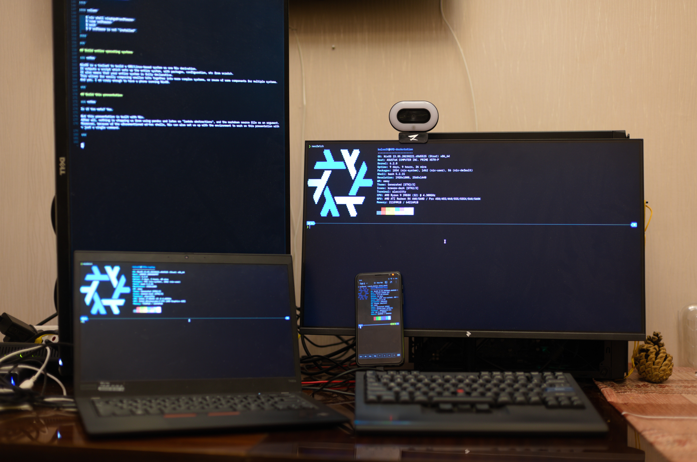
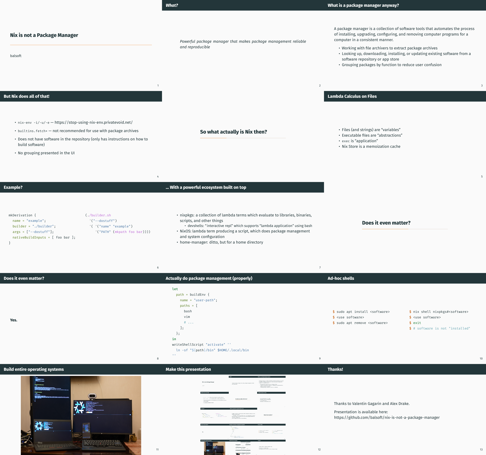

## _What?_

::: notes
After reading the title of this presentation, you are probably questioning my sanity.
Your inquiry is not unreasonable; after all, the official Nix package description states
:::

> Powerful package manager that makes package management reliable and reproducible

::: notes
However, I'll still present my case for why it is not.
:::

## What is a package manager anyway?

A package manager is a collection of software tools that automates the process of installing, upgrading, configuring, and removing computer programs for a computer in a consistent manner.

- Working with file archivers to extract package archives
- Looking up, downloading, installing, or updating existing software from a software repository or app store
- Grouping packages by function to reduce user confusion

## But Nix does all of that!

::: notes
While it is true that Nix has the ability to perform most of those tasks, it actually sucks at them by itself!
:::

- `nix-env -i/-u/-e` — <https://stop-using-nix-env.privatevoid.net/>

::: notes
`nix-env` is infamous in the community for how bad the interface and the underlying machinery are;
:::

- `builtins.fetch*` — not recommended for use with package archives

::: notes
`builtins.fetch*` can technically be used to fetch package archives, but it is not recommended;
:::

- Does not have software in the repository (only has instructions on how to build software)

::: notes
The main repository of Nix packages, `nixpkgs`, does not contain actual software in the way other repositories do; it contains just the descriptions of how to build the software.
:::

- No grouping presented in the UI

::: notes
While nixpkgs does group the packages in the file layout, this is not presented to the end user, and there's an RFC to remove even that structure.
:::

# So what actually is Nix then?

## Lambda Calculus on Files

::: notes
Well, if you look through 20 years of legacy cruft, Nix is actually just Lambda Calculus on files.
:::


- Files (and strings) are "variables"
- Executable files are "abstractions"
- `exec` is "application"
- Nix Store is a memoization cache

## Example?

::: columns

:::: column

```nix
mkDerivation {
  name = "example";
  builder = "./builder";
  args = ["--dostuff"];
  nativeBuildInputs = [ foo bar ];
}
```

::::

:::: column

```lisp
(./builder.sh 
  '("--dostuff")
  '( '("name" "example")
     '("PATH" (mkpath foo bar))))
```

::::

:::

## ... With a powerful ecosystem built on top

- nixpkgs: a collection of lambda terms which evaluate to libraries, binaries, scripts, and other things
  + devshells: "interactive repl" which supports "lambda application" using bash
- NixOS: lambda term producing a script, which does package management and system configuration
- home-manager: ditto, but for a home directory

# Does it even matter?

**Yes.**

::: notes

The fact that Nix itself is not a package manager might seem like a technicality at first, but it actually means it can do a lot more then a typical package manager would allow you to.

:::

## Actually do package management (properly)

::: notes

But let's start with something simpler.
After all, just because Nix itself is not a package manager, it doesn't mean that it can't be used for package management.
This approach gives you declarative package management, which can be rolled back easily if desired.
(note that this is basically what Nix profiles are; so, you can use `nix-env --set` to achieve similar results)

:::

```nix
let
  path = buildEnv {
    name = "user-path";
    paths = [
      bash
      vim
      # ...
    ];
  };
in
writeShellScript "activate" ''
  ln -sf "${path}/bin" $HOME/.local/bin
''
```


## Ad-hoc shells

::: notes

Since Nix is not a package manager, it has a ways to access software without "installing" it.
It simply builds it, and gives you a shell with access to that software.
After you close the shell, the software stays memoized in the store, but will get "garbage collected" soon.
This means you can easily use multiple versions of same software and not bother about conflicts.

:::

::: columns

:::: column

    $ sudo apt install <software>
    $ <use software>
    $ sudo apt remove <software>

::::

:::: column

    $ nix shell nixpkgs#<software>
    $ <use software>
    $ exit
    $ # software is not "installed"

::::

:::

## Build entire operating systems

::: notes

NixOS is a toolset to build a GNU/Linux-based system as one Nix derivation.
It outputs a script which sets up the entire system, with packages, configuration, etc from scratch.
This means that your entire system is fully declarative, which allows for easily composing smaller bits together into more complex systems, or reuse of same components for multiple systems.
And yes, I am crazy enough to have a phone running NixOS.

:::



## Make this presentation

::: notes

Is it too meta? Yes.

But this presentation is built with Nix.
After all, nothing is stopping us from using pandoc and latex as "lambda abstractions", and the markdown source file as an argument.
Moreover, because of the aforementioned ad-hoc shells, Nix can also set us up with the environment to work on this presentation with just a single command.

:::




## Thanks!

Thanks to Valentin Gagarin and Alex Drake.

Presentation is available here: <https://github.com/balsoft/nix-is-not-a-package-manager>